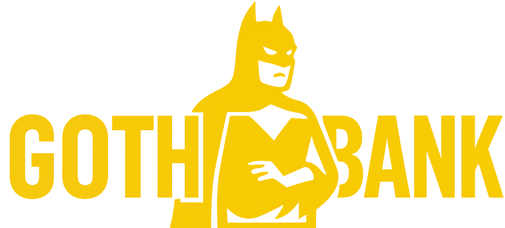

# Gotham Bank Management System



A modern, responsive, and secure web-based bank management system built with Python Flask. This application provides a complete banking solution with user authentication, account management, and transaction processing.

## 🚀 Features

### User Authentication
- Secure user registration and login system
- Session management with Flask-Login
- Password hashing for security
- Flash messages for user feedback

### Account Management
- Create and manage bank accounts
- View account details and balance
- Update personal information
- Secure account deletion

### Transaction Processing
- Deposit funds into accounts
- Withdraw funds with balance validation
- View transaction history
- Real-time balance updates

### User Interface
- Modern, responsive design
- Interactive dashboard
- Intuitive navigation
- Mobile-friendly layout
- Custom video background with mute toggle

### Security
- CSRF protection
- Secure password storage
- Form validation
- Protected routes
- Session timeout

## 🛠️ Technologies Used

### Backend
- Python 3.x
- Flask (Web Framework)
- SQLAlchemy (ORM)
- SQLite (Database)
- Werkzeug (Security)

### Frontend
- HTML5
- CSS3 (with custom theming)
- JavaScript (Vanilla)
- Bootstrap 5 (Responsive Design)
- Font Awesome (Icons)

### Development Tools
- Git (Version Control)
- VS Code (Code Editor)
- Chrome DevTools (Debugging)

## 🚀 Getting Started

### Prerequisites
- Python 3.8 or higher
- pip (Python package manager)
- Git (for version control)

### Installation

1. **Clone the repository**
   ```bash
   git clone https://github.com/yourusername/bank-management-system.git
   cd bank-management-system
   ```

2. **Create a virtual environment**
   ```bash
   python -m venv venv
   source venv/bin/activate  # On Windows: venv\Scripts\activate
   ```

3. **Install dependencies**
   ```bash
   pip install -r requirements.txt
   ```

4. **Initialize the database**
   ```bash
   python init_db.py
   ```

5. **Run the application**
   ```bash
   python app.py
   ```

6. **Access the application**
   Open your browser and navigate to `http://localhost:5000`

## 📂 Project Structure

```
bank-management-system/
├── static/                 # Static files (CSS, JS, images)
│   ├── css/
│   ├── js/
│   └── images/
├── templates/              # HTML templates
│   ├── base.html           # Base template
│   ├── index.html          # Home page
│   ├── login.html          # Login page
│   ├── register.html       # Registration page
│   ├── dashboard.html      # User dashboard
│   └── ...
├── app.py                 # Main application file
├── models.py              # Database models
├── forms.py               # Form validations
├── requirements.txt       # Project dependencies
└── README.md              # Project documentation
```

## 🌐 API Endpoints

| Endpoint | Method | Description | Authentication Required |
|----------|--------|-------------|-------------------------|
| / | GET | Home page | No |
| /login | GET, POST | User login | No |
| /register | GET, POST | User registration | No |
| /dashboard | GET | User dashboard | Yes |
| /deposit | GET, POST | Deposit funds | Yes |
| /withdraw | GET, POST | Withdraw funds | Yes |
| /profile | GET, POST | User profile | Yes |
| /logout | GET | User logout | Yes |

## 🎨 Theme & Styling

The application features a dark theme with a yellow accent color scheme, inspired by the Gotham City aesthetic. The responsive design ensures optimal viewing experience across all devices.

### Color Scheme
- **Primary Background**: #111111 (Dark Gray)
- **Secondary Background**: #1a1a1a (Lighter Gray)
- **Accent Color**: #39FF14 (Neon Green)
- **Text Color**: #FFFFFF (White)
- **Secondary Text**: #CCCCCC (Light Gray)

## 🔒 Security Features

- Password hashing using Werkzeug
- CSRF protection
- Secure session management
- Input validation
- Protection against SQL injection
- Rate limiting on authentication endpoints

## 📱 Responsive Design

The application is fully responsive and works on:
- Desktop computers
- Tablets
- Mobile devices

## 🚀 Future Enhancements

- [ ] Implement fund transfer between accounts
- [ ] Add transaction history with filtering
- [ ] Integrate email notifications
- [ ] Add two-factor authentication
- [ ] Implement admin dashboard
- [ ] Add support for multiple currencies
- [ ] Implement password reset functionality

## 🤝 Contributing

Contributions are welcome! Please follow these steps:

1. Fork the repository
2. Create a new branch (`git checkout -b feature/AmazingFeature`)
3. Commit your changes (`git commit -m 'Add some AmazingFeature'`)
4. Push to the branch (`git push origin feature/AmazingFeature`)
5. Open a Pull Request

## 📄 License

This project is licensed under the MIT License - see the [LICENSE](LICENSE) file for details.

## 👏 Acknowledgments

- [Flask Documentation](https://flask.palletsprojects.com/)
- [Bootstrap 5](https://getbootstrap.com/)
- [Font Awesome](https://fontawesome.com/)
- [Poppins Font](https://fonts.google.com/specimen/Poppins)

---

<div align="center">
  Made with ❤️ by Your Name
</div>
